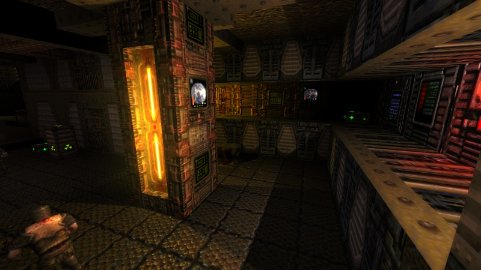

# Simple Quake Texture Enhancements

A collection of bump, gloss, and glow textures to enhance the original Quake game textures.

  

## Installation

Download a [release](https://github.com/hemebond/quake-textures/releases/) and extract directly into your `quake/id1/textures/` directory (create the `textures` directory if it doesn't exist).

## Usage ##

### Settings

The original pixelated Quake look can be achieved by using `nearest` texture filtering. This can be enabled with the console command:

`gl_texturemode gl_nearest_mipmap_linear`

### Realtime Lighting

To get the most out of the textures real-time lighting is required. While the map lights can be used by default for real-time lighting, for best results [custom rtlights files](https://github.com/hemebond/quake-rtlights/) can be used.

